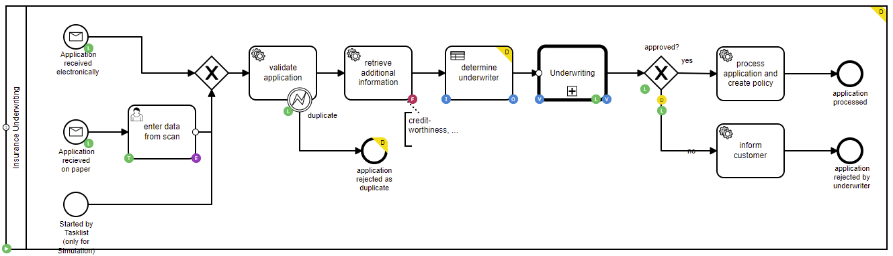
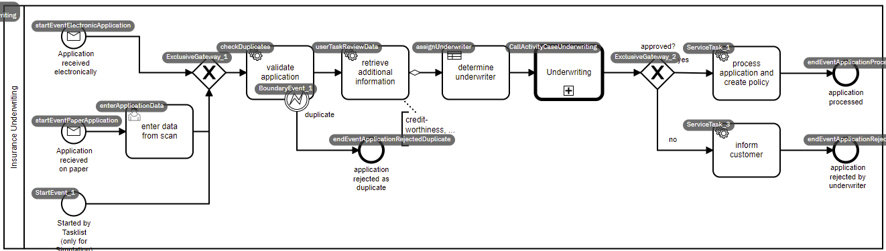

<h1 align="center">
  Camunda Modeler Property Info Plugin
</h1>

<h4 align="center">This plugin serves a better overview which properties are set per shape.</h4>

    
  
  
  

 

## About plugin
__Camunda Modeler Property Info Plugin__ created by __mesoneer AG__ allows its users to have a batter overview over BPMN processes which may be helpful to get a better understanding of how the processes are built and how the elements interact. 
This Plugin is useful for processes of any size and complexity and may be helpful for developers and business specialists in order to better understand what is _'under the hood'_.

 

## How to install
__Windows__:
* Create new folder in your Camunda directory - `{MODELER_LOCATION}/plugins`
* Download and unzip plugin files into a new `plugins` folder

__MacOS__:
* Create new `plugins` folder in `/Users/{USER_NAME}/Library/Application Support/camunda-modeler` directory
* Download and unzip plugin files into a new `plugins` folder

_A compressed version is always available in the release section._

## How to use

When in Modeler:

Press **Alt + Y** to display Main Elements  
Press **Alt + T** to display Transactions and Job Priorities  
Press **Alt + X** to display Element IDs  

## Possible Badges

 Input 
 Output 
 Variable

 Listener 
 Task Listener

 Extension 
 Field Injection

 Element id 
 Documentation 
 Transactions

 Is Executable 
 Is not Executable

## Licence

[Apache License, Version 2.0, January 2004](http://www.apache.org/licenses/)
